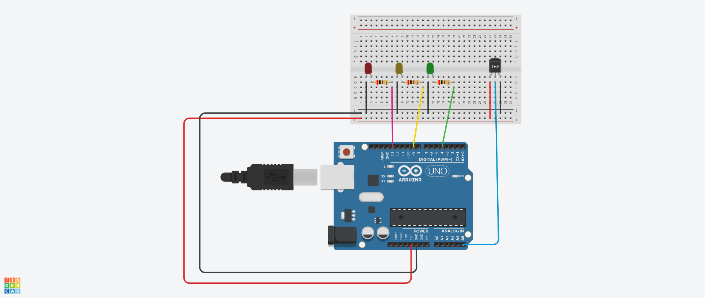

# iot-exemplo2

Discente: Priscila Frost

Docente: Amanda Paul Dull

Esse repositório serve de exemplo para a entrega de atividades da matéria de IoT.

[![Simular no Tinkercad]

## Enunciado: Sensor de temperatura

Montar um circuito com um sensor de temperatura e três LEDs para mostrar diferentes níveis de temperatura.

## Materiais necessários

| Qtd | Componente |
|-----|------------|
| 1 | Placa Arduino UNO |
| 1 | Cabo USB |
| 1 | Protoboard |
| 1 | Sensor de temperatura LM35 |
| 3 | Resistor 220 kΩ |
| 1 | LED vermelho difuso |
| 1 | LED amarelo difuso |
| 1 | LED azul difuso |
| 1 | Potenciometro |
| — | Fios de jumper macho-macho |
